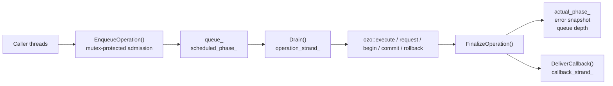
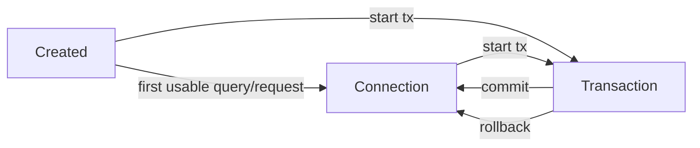
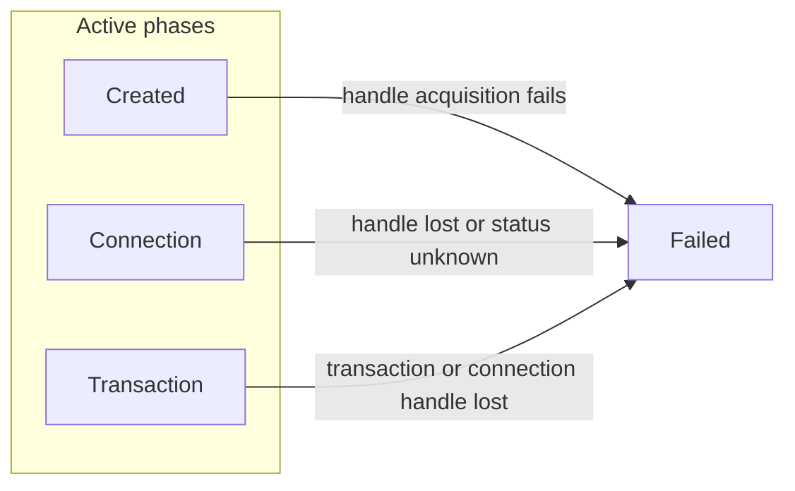
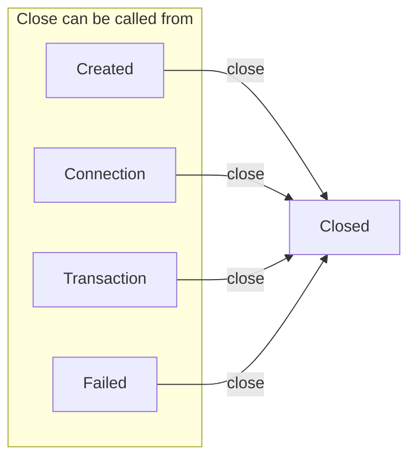
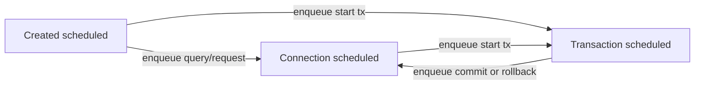
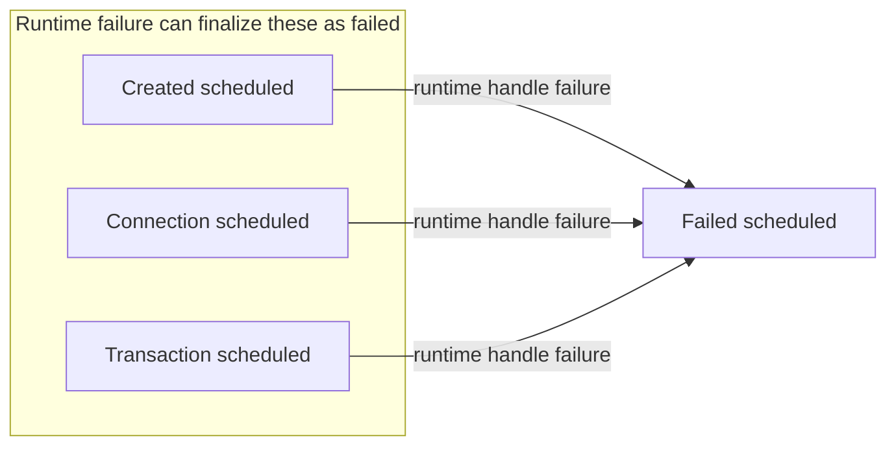
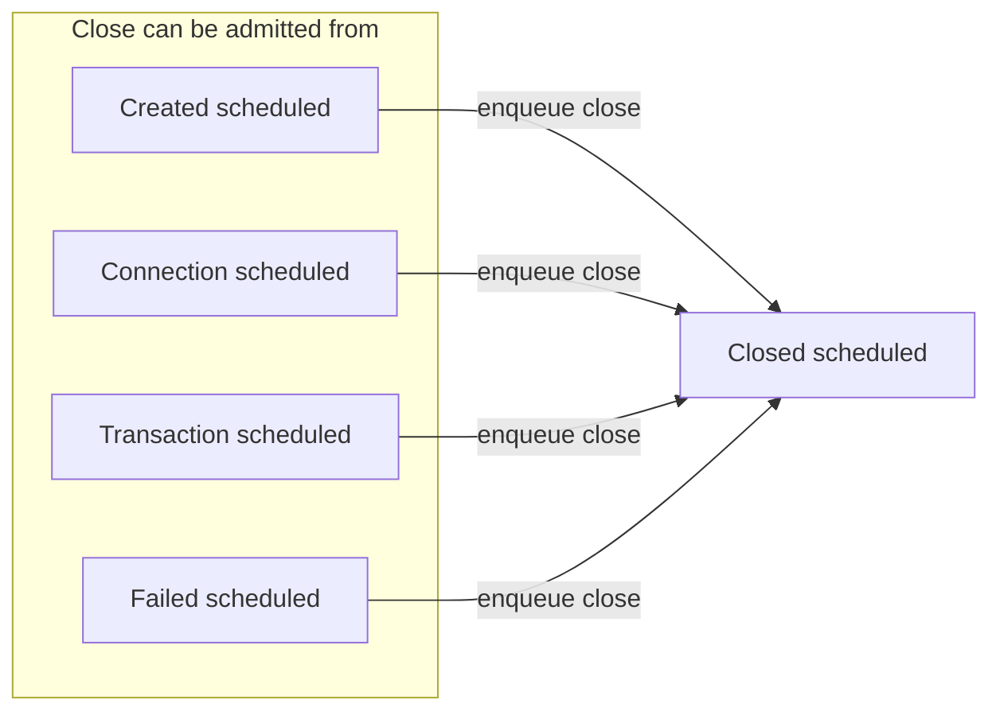

# PostgreSqlTask Design

This document is for maintainers, advanced users, and anyone debugging task
behavior. It describes the implementation model behind
`bozo::postgresql::PostgreSqlTask`.

If you only need to call the API, start with the
[PostgreSqlTask Guide](../guides/postgresql-task.md).

## Why This Type Exists

`ozo` exposes asynchronous PostgreSQL primitives, but a user still has to
reason about:

- connection lifetime
- transaction lifetime
- serialized access to one session
- callback ordering
- state snapshots after success, failure, cancellation, or close

`PostgreSqlTask` packages those concerns into one task-shaped object with a
stable public lifecycle.

## Design Goals

- expose a small public phase model that callers can reason about
- serialize all operations per task, even under concurrent submission
- keep callbacks ordered with the operation stream
- separate user-visible task errors from OZO/PostgreSQL errors
- keep `Close()` deterministic for queued and in-flight work

## Non-Goals

- no attempt to hide PostgreSQL transaction semantics
- no cross-task scheduling guarantees
- no public API for arbitrary OZO handle injection or custom composite decoders

## Parameterized Query Adaptation

`bozo` now exposes its own `bozo::postgresql::MakeQuery()` and SQL-text
overloads on `PostgreSqlTask`.

This is not just API sugar. The default OZO `Query` path reads parameters
through `const` query accessors, which is fine for copyable values but does not
fully support move-only parameters. `bozo` avoids that limitation by:

- adapting `ParameterizedQuery` directly to `ozo::binary_query`
- storing queued start operations behind a move-only type erasure instead of
  `std::function<void()>`

OZO-native query objects such as `_SQL`, `ozo::query_builder`, and
`ozo::make_query(...)` still work. The stronger move-only guarantee applies to
the bozo-owned parameterized query path.

## Core Runtime Pieces

| Piece | Role |
| --- | --- |
| `actual_phase_` | The public phase published through `GetState()` and callback snapshots. |
| `scheduled_phase_` | The future phase assumed by the admission gate while queued work has not run yet. |
| `queue_` | FIFO of user operations waiting to start. |
| `operation_in_flight_` | Tracks whether one operation has already been started. |
| `close_requested_` | Prevents new work and starts the close path. |
| `handle_` | Current connection or transaction handle, or `std::monostate` if unavailable. |
| `operation_strand_` | Ensures only one OZO operation mutates task internals at a time. |
| `callback_strand_` | Serializes callback delivery. |

The implementation is split across:

- `include/bozo/postgresql/postgresql_query.h`
  bozo-owned parameterized query type and OZO binary-query adaptation
- `include/bozo/postgresql/postgresql_task.h`
  public API, core fields, and non-template declarations
- `include/bozo/postgresql/postgresql_task-inl.h`
  template request/execute entry points and OZO invocation paths
- `src/postgresql/postgresql_task_state.cc`
  snapshots, error categories, transition validation, phase derivation
- `src/postgresql/postgresql_task_lifecycle.cc`
  queue draining, close path, cancellation, and transaction control
- `src/postgresql/postgresql_task_factory.cc`
  direct and pooled factory construction

## Execution Architecture

The key point is that submission and execution are different phases:

- submission is synchronized by `mutex_`
- execution/finalization is serialized by `operation_strand_`
- callback delivery is serialized by `callback_strand_`

This separation is why `scheduled_phase_` exists.

## Public Runtime State Machine

The following state machine is what users observe through `GetState()` and
`PostgreSqlTaskResult::GetState()`.

Mermaid gives very limited control over edge routing in `stateDiagram`, so this
document uses smaller `flowchart` diagrams and tables instead of one dense
all-in-one graph.

### Same-Phase Outcomes

| Current phase | Event or outcome | Next phase |
| --- | --- | --- |
| `kConnection` | `Execute()` / `Request*()` succeeds | `kConnection` |
| `kConnection` | statement fails but the returned handle stays usable | `kConnection` |
| `kTransaction` | `Execute()` / `Request*()` succeeds | `kTransaction` |
| `kTransaction` | statement fails and PostgreSQL marks the transaction aborted | `kTransaction` |

### Failure Exits

### Close Exits

### What Counts As `kFailed`

`kFailed` is reserved for unusable-handle cases, not every SQL error.

`DeterminePhaseFromHandle()` maps the returned OZO handle like this:

- null or bad handle: `kFailed`
- `transaction_status::idle`: `kConnection`
- `transaction_status::transaction`, `error`, or `active`: `kTransaction`
- `transaction_status::unknown`: `kFailed`

That means a PostgreSQL transaction already marked aborted still reports
`kTransaction`, because the task still owns a transaction-scoped handle.

## Admission State Machine

Admission rules are checked before work starts. They use `scheduled_phase_`,
not `actual_phase_`.

This matters because queued work should be validated against the state that will
exist once older queued work completes.

Example: `StartTransaction()` may be queued first, and an immediate
`CommitTransaction()` is accepted right after it even though the public phase is
still `kCreated` until the first callback runs.

### Scheduled Failure Finalization

### Scheduled Close Admission

### Admission Table

| Scheduled phase | Execute / Request* | StartTransaction | Commit / Rollback | Close |
| --- | --- | --- | --- | --- |
| `kCreated` | allowed | allowed | rejected | allowed |
| `kConnection` | allowed | allowed | rejected | allowed |
| `kTransaction` | allowed | rejected | allowed | allowed |
| `kFailed` | rejected | rejected | rejected | allowed |
| `kClosed` | rejected | rejected | rejected | rejected |

Rejected operations fail synchronously with:

- `PostgreSqlTaskErrc::kClosed` if close was requested or already completed
- `PostgreSqlTaskErrc::kFailed` if the task is already terminally failed
- `PostgreSqlTaskErrc::kInvalidState` for impossible transitions

## Close And Cancellation Semantics

`Close()` is not just another queued operation. It changes admission behavior
immediately and then drains the task into a terminal closed state.

The close sequence is:

1. Set `close_requested_ = true`.
2. Set `scheduled_phase_ = kClosed`.
3. Move queued-but-not-started operations into `cancelled_pending_operations_`.
4. Reject all new public operations with `kClosed`.
5. Cancel the active handle, if any.
6. When the in-flight operation finalizes, close the active handle.
7. Publish `kClosed`.
8. Deliver cancelled queued callbacks with `kCancelled` plus
   `boost::asio::error::operation_aborted`.
9. Deliver close callbacks with an `Ok()` result and a closed snapshot.

Two consequences are important:

- queued operations cancelled by `Close()` do not run
- the in-flight operation, if any, still receives its own callback first; that
  callback may carry cancellation or transport errors even though its snapshot
  phase is already `kClosed`
- close callbacks observe the final closed snapshot after cleanup

## Failure Propagation Rules

There are three intentionally different behaviors:

### 1. Handle Acquisition Or Handle Survival Failure

If the returned handle is unusable, the task becomes `kFailed`. Pending queued
operations are completed with local `kFailed`, and new work is rejected until
`Close()`.

### 2. Statement Failure In Connection Mode

If OZO reports a statement error but the returned handle is still in
`transaction_status::idle`, the task stays in `kConnection`. The error snapshot
is stored, and a later successful operation clears it.

### 3. Statement Failure In Transaction Mode

If the returned handle reports `transaction_status::error`, the task stays in
`kTransaction`. PostgreSQL has aborted the transaction, so more statements keep
failing until `RollbackTransaction()`.

This preserves real PostgreSQL semantics instead of hiding them behind a
synthetic bozo-only failure state.

## Snapshot Rules

`GetState()` and callback snapshots publish:

- the current `actual_phase_`
- the last local task error
- the last OZO error
- copied PostgreSQL error message and context, if available
- queue depth as `queue_.size() + operation_in_flight_`

Snapshots are immutable values. Earlier snapshots do not change when the task
later moves to another phase.

## How To Debug One Callback

If you are a user investigating behavior, read callback results in this order:

1. `result.Ok()`
2. `result.GetTaskError()`
3. `result.GetOzoError()`
4. `result.GetState().GetPhase()`
5. `result.GetState().GetLastErrorMessage()`
6. `result.GetState().GetLastErrorContext()`

The combination usually tells you which layer failed:

- local policy rejected the call
- PostgreSQL rejected the statement
- the connection or transaction handle became unusable
- the task was closed while work was pending

## Tests That Lock This Behavior Down

- `tests/general/postgresql/unit_postgresql_task_test.cc`
  - admission checks
  - queue ordering
  - close cancellation
  - snapshot immutability
  - concurrent enqueue behavior
- `tests/general/postgresql/integration_postgresql_task_test.cc`
  - request decoding
  - transaction commit/rollback visibility
  - autocommit recovery after SQL error
  - transaction-aborted recovery after rollback
  - failed-connection terminal behavior

## Change Checklist

When changing lifecycle behavior, update all of the following together:

- `PostgreSqlTaskPhase` and public docs
- `ValidateTransitionLocked()`
- `DeterminePhaseFromHandle()`
- close-path callback semantics
- unit tests covering admission and queue behavior
- integration tests covering real PostgreSQL behavior
- Mermaid diagrams in this document
